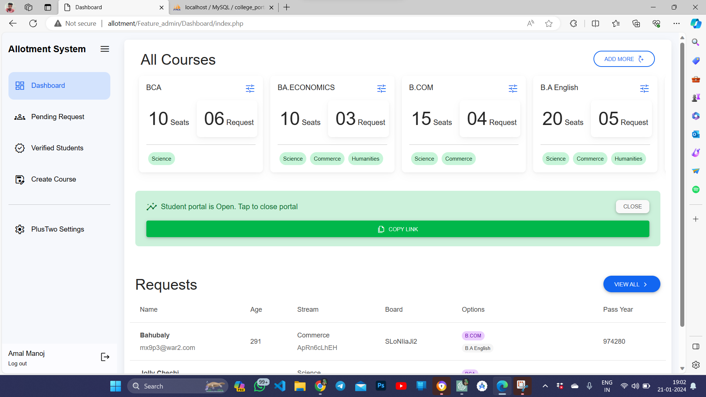
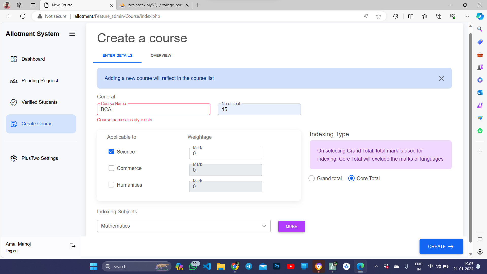
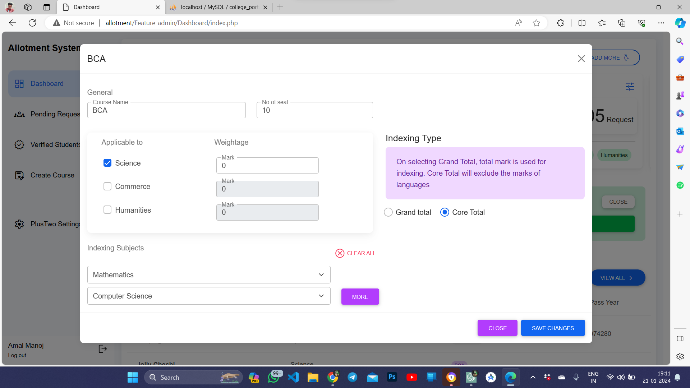
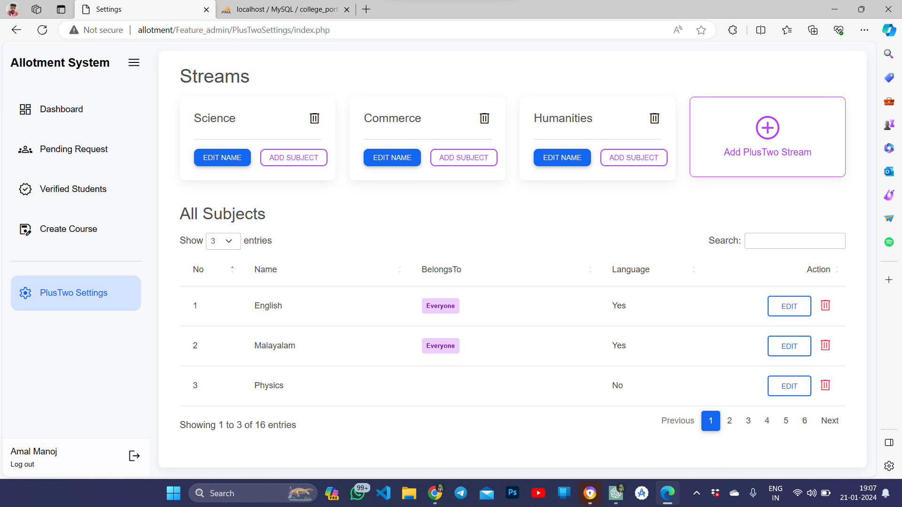
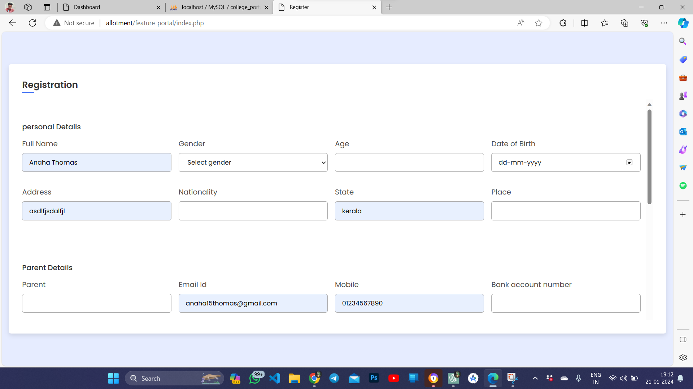
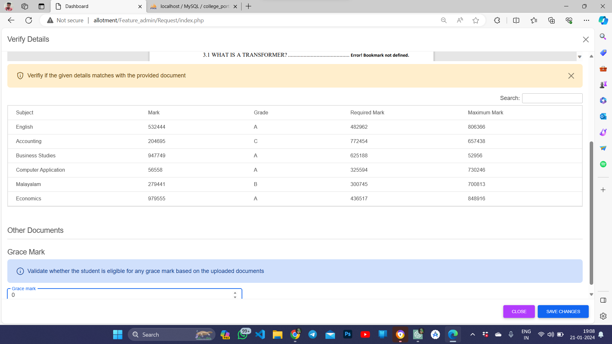
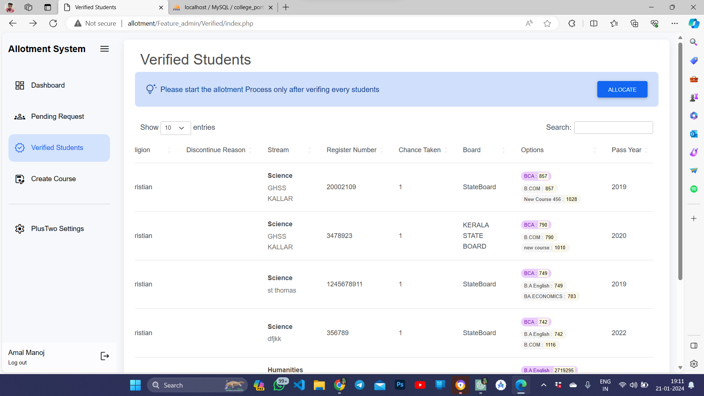
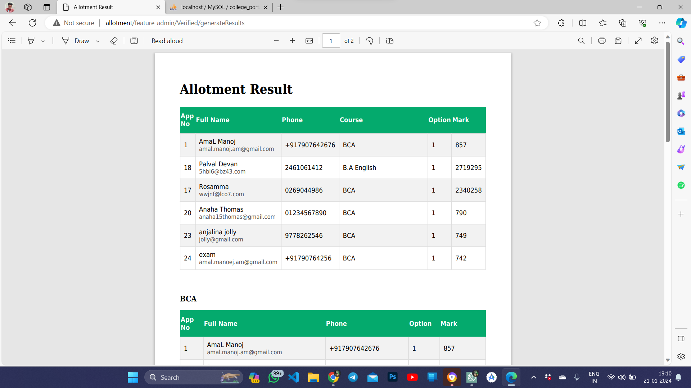

# Project---Allotment
A simple allotment system for college/student allotment

### Login Page

### Admin's Dashboard
Here Admin can manage all registered courses and the student registration process

### Create or Add New Courses
Admin can add course details which will be reflected in the application process

### Edit Added Courses Anytime

### Add/Update Plus Two Details and subject
Here, college administrators can manage Plus Two streams, such as science, commerce, and humanities. They can add new streams and update subjects associated with each stream. Examples of subjects include:

| **Science Stream**   | **Commerce Stream** | **Humanities Stream** |
| -------------------- | -------------------- | ---------------------- |
| Mathematics          | Accountancy          | History                |
| Physics              | Business Studies      | Geography              |

### User-Facing Registration Form for College Portal
This is how a student will apply to courses in that college (one student can apply to multiple courses based on his plus-two stream)

### Verify Details of Applied Students and Their Courses
Admin can see student details and scores and uploaded documents for verification

### View Verified Reports
Here admin can see all the verified students and index marks on each subject

### Final Report
The final report provides a PDF summary of allotment results, determined by a comprehensive evaluation process that considers various factors. The allotment is primarily based on the applicant's Plus Two marks, utilizing a scoring system for the applied course. Furthermore, the allotment process incorporates the following elements:
- **Course Weightage:** The administrator has the flexibility to control the eligibility of certain courses for specific student backgrounds. For instance, a science student may apply to any course, but the allotment can be influenced by the course weightage. This allows prioritization of students from the humanities stream for certain courses.
- **Indexing Subjects:** In cases like science subjects, such as BCA, the allotment process goes beyond the overall score. It considers specific indexing subjects, like mathematics or computer science, adding an extra layer of precision to the evaluation. This ensures a nuanced and fair allotment process that takes into account the unique requirements of different courses and subject areas.

